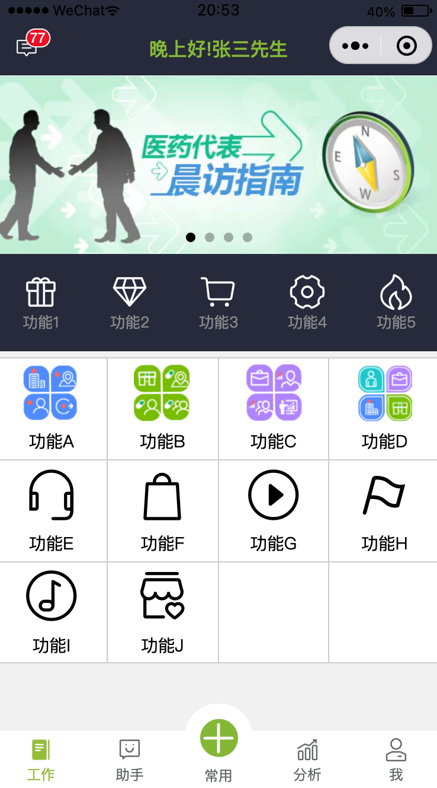
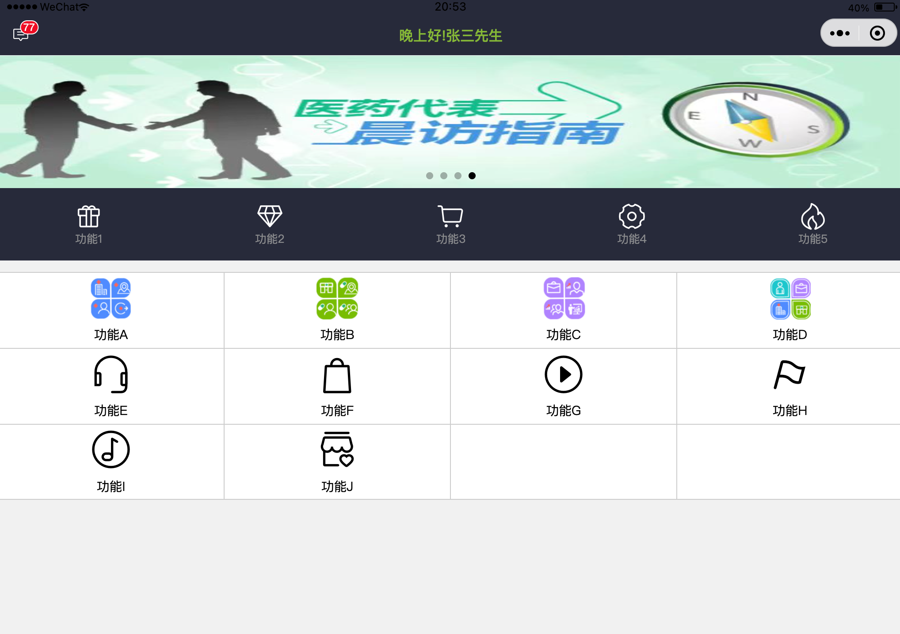
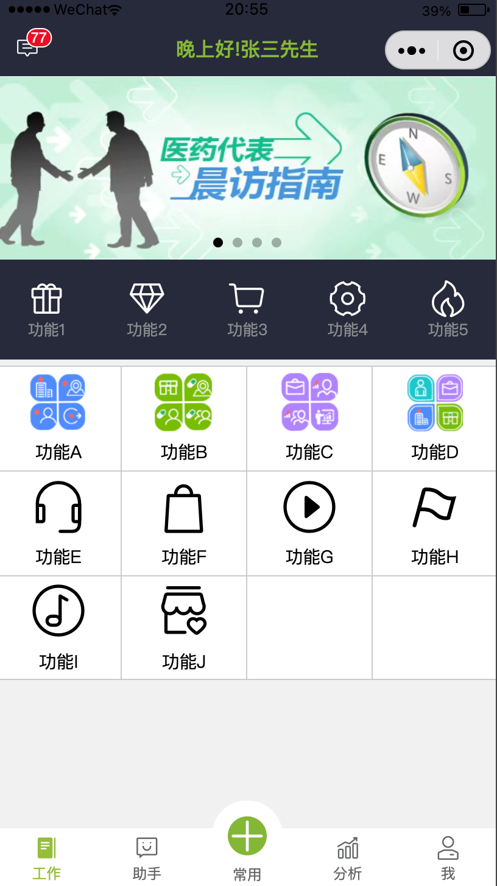

### S2P 小程序
```sh
yarn
```

### 使用微信原生的方式开发的小程序，ui框架用的vant weapp
  - 自定义了navbar和tabbar组件
  - 通过组件的方式将页面功能组织起来，比如弹窗组件、网格组件
  - 点击功能B有弹窗
  - 适应各种机型屏幕
      - iphone 5
          
      - iphone 6
          
      - ipad pro 12.9-inch
          
      - Nexus 6
          